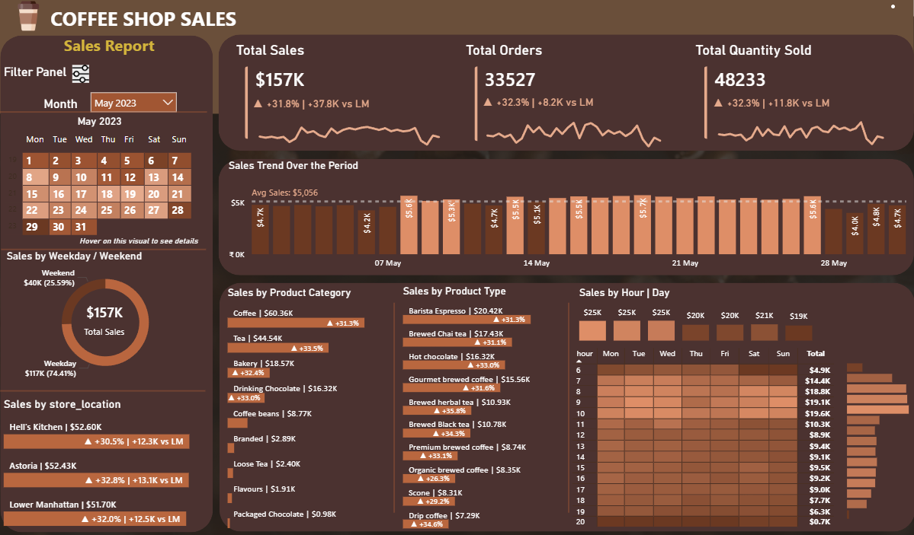

# ☕ Coffee Shop Sales Dashboard – Power BI

---

## 📌 Project Overview
This project showcases an interactive **Coffee Shop Sales Dashboard** built using **Power BI**. The dashboard is designed to analyze sales performance in a simple and business-friendly manner, allowing users to compare monthly trends and identify key drivers using dynamic visuals and DAX calculations.

---

## 📊 Dashboard Preview

---

## 🎯 Project Objectives
- Analyze monthly sales performance  
- Track month-on-month (MoM) growth and decline  
- Identify top-performing products, stores, and peak sales periods  

---

## 📈 Key Performance Indicators (KPIs)
- **Total Sales**  
- **Total Orders**  
- **Total Quantity Sold**  
- **Month-on-Month % Change**  
- **Month-on-Month Difference**  

---

## 📅 Sales Analysis & Visuals
- Calendar heat map to analyze daily sales patterns  
- Weekday vs weekend sales comparison  
- Daily sales trend with average line  
- Day and hour sales heat map to identify peak periods  

---

## 🏬 Store & Product Insights
- Sales analysis by store location  
- Sales by product category  
- Top 10 products by sales  

---

## 🛠 Tools & Technologies Used
- Power BI  
- DAX  
- Data Modeling  
- Interactive Slicers and Tooltips  

---

## ✅ Key Outcomes
This dashboard provides a clear, structured, and interactive view of coffee shop sales performance, enabling stakeholders and non-technical users to make data-driven business decisions efficiently.

---
